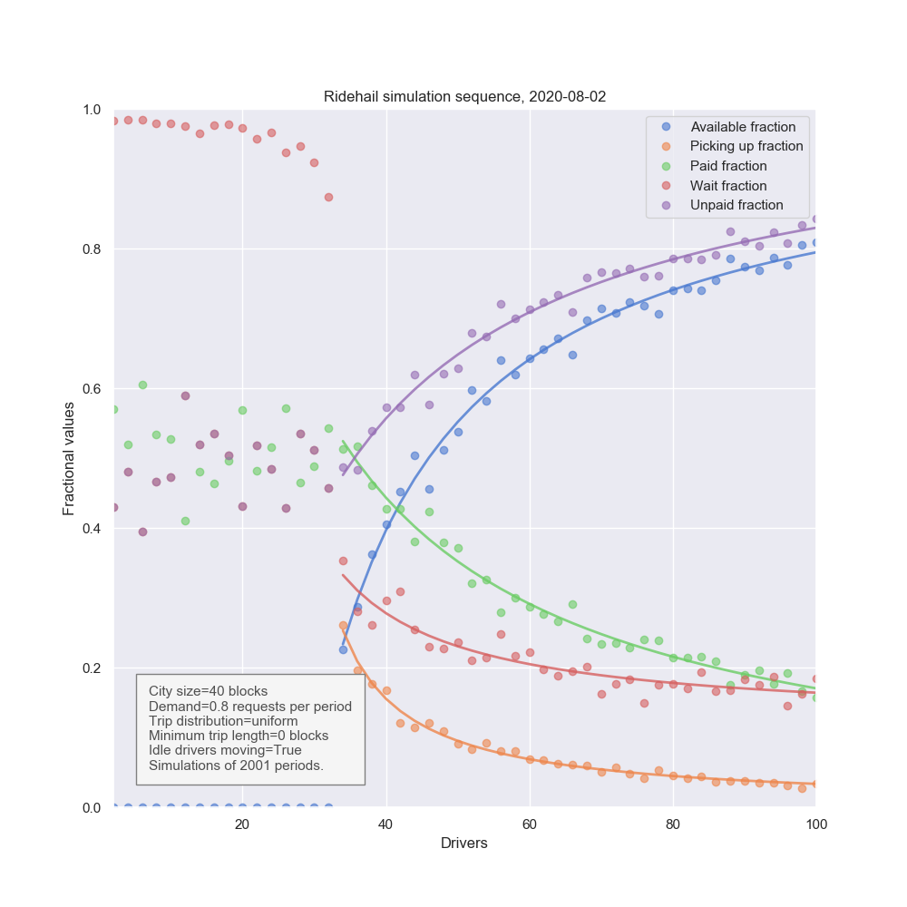

# Algorithm notes

## Geometry

Here is a chart of driver and trip characteristics for a city of size 40 blocks
on a side, with a demand of 0.8 requests per period, distributed uniformly and
randomly and with uniform random distances.



Some observations:

- At least 36 drivers are needed to keep up with the trip requests. If there
  are fewer than 36 drivers, there is no &ldquo;available&rdquo; time for any
  driver because they are re-assigned as soon as they become free. Also, the
  &ldquo;wait fraction&rdquo; of a trip is close to unity: by the end of the
  simulation the drivers are so far behind that the trips are spent waiting.

- Although there is some dispersion, with fewer than 36 drivers the drivers
  spend half the time going to pick up rides and half the time with a passenger
  in the car. This is because at that time a driver &#x2013; wherever they are
  in the city &#x2013; will be assigned to a new ride as soon as they become
  available. As the rides are randomly placed and of random length, both the
  journey to pick up and the trip itself have the same distributions (average
  length L/2, where L is the length of the side of the city). Many cities
  report busy fractions (P3) in the 65% to 70% range by time: we shall see
  later what we need to get above 50% busy time.

- Once there are enough drivers to make a steady state, the availability time
  (P1 phase) grows quickly, and the busy phase (P3) drops, and the pick-up
  phase (P2) drops even quicker. As soon as there is a choice of drivers to
  assign to a trip, the nearer one will be chosen. As a result, the pick-up
  distance is shorter than the average trip length, which is still L/2.

- The wait time falls quickly to around 0.2 of the total trip time, but then
  levels off.

- While all these solutions are geometrically possible, there is no mention yet
  of price. In the next section, economics will narrow the field, and will
  select equilibrium outcomes from among the geometric possibilities.

## Equilibration

### Supply utility

The supply utility function (for drivers) is, per block of time:

```bash
U_S = (1 - f) . p . x - c
```

where:

- f is the platform factor: a commission if f &gt; 0 and
  a subsidy if f &lt; 0.
- x is the fraction of time the driver is being paid (P3 phase) p is the price
  per block
- c is the driver reservation price: all the driver costs per block,
  including opportunity costs

There is no fixed cost here (like purchase of a vehicle) but the idea is to
keep it simple.

### Demand

Demand is taken to be almost-exogenous. That is, the model does not use a
demand-side utility function, but just a net demand:

D = k p <sup>-r</sup>

where

- D is the number of ride requests per time interval,
- k is the "base demand" or the ride requests when p = 1, and
- _-r_ is the elasticity.

This is a constant elasticity form.

### Equilibration

During a simulation, there is periodically be an equilibration operation which
resets the number of drivers and the request rate.

The input to the supply-equilibration operation is the average driver utility,
computed over a window of time.

For drivers (supply), the criterion is that if \(U_S\) is positive, then other
drivers can enter and still make money. If \(U_S\) is negative, then some
drivers are not finding it worth their while and so the number of drivers
drops.

In the same way, if the average demand utility is positive, then there is an
opportunity for other trips to be taken profitably and so the request rate
increases. If the average demand utility is negative, then some trips are not
worth taking and so the request rate decreases.

In some cases, changes to demand are exogenous. Rush hour, big events, and
other external factors drive demand. In contrast, changes to the supply of
drivers is more endogenous: if there is money to be made, someone will make it.

### Supply-side equilibration

If we treat demand and price as exogenously fixed, the driver count
equilibrates at S (S = number of drivers) such that the average utility of the
drivers is zero. That is:

```bash
x = c / (f . p)
```

If we choose p and f to be unity (p to fix a scale, and f to ignore platform
actions for now) then this means that the point at which the busy fraction (P3)
equals the cost per unit (in units of the fare price) is the number of drivers.

Take Seattle, with trips [from Union Square to SFO](https://www.uber.com/us/en/price-estimate/).

> From Union Square to San Francisco International Airport (SFO), the ride is
> approximately 13 miles and about 16-22 minutes without traffic. Prices may
> change due to increased rider demand, discounts, or traffic conditions.

For UberX the value is going to be about $20 and most of this is distance.
Let&rsquo;s say P = $1.5 per mile.

If B = 65% as in some cities, and P is \$1.50 per mile, and if Uber takes a 25%
commission so f = 0.75, then costs (including opportunity costs) are

```bash
c = 0.65 * 0.75 * 1.50 ~ 0.75 per mile
```

If they are driving at 40 mph, which is what the quote above says, then the
total costs must be about $30 per hour. That is, the drivers must get a gross
pay of $40 per hour to make it worth their while. What the take home is after
that remains to be seen, but if the opportunity cost is the minimum wage ($15
per hour) then the costs must be about $25 per hour.

So the rider pays $20, of which $5 goes to Uber, $8 is costs, and $5 is driver
pay. The numbers need checking here, but the idea seems roughly sound.

If estimated costs are much lower than 0.75 per mile, then we need an
explanation of why other drivers are not coming in and making some money.
