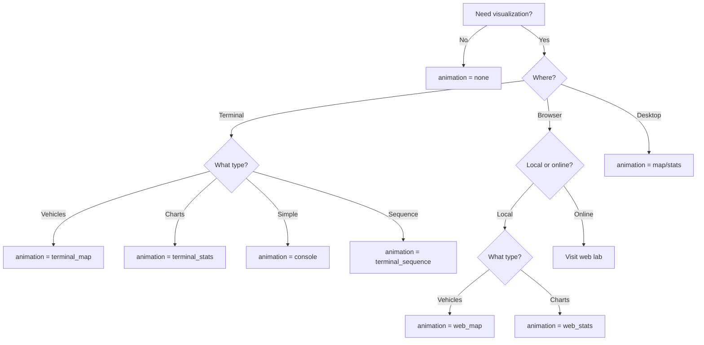

# Animation Modes

Ridehail provides multiple visualization modes for different use cases: terminal-based for lightweight real-time monitoring, desktop for detailed analysis, and browser for no-installation experiments.

## Available Animation Modes

### Terminal-Based (Textual)

Modern terminal UI with real-time updates:

- **terminal_map** - Live vehicle map with trip markers
- **console** - Text-based progress bars and metrics
- **terminal_stats** - Real-time line charts using plotext
- **terminal_sequence** - Scatter plots for parameter sweeps

**Requirements**: Included in base install (`pip install ridehail`)

**Best for**: Development, real-time monitoring, remote servers, quick experiments

### Browser-Based (Local)

Automatically opens browser with Chart.js visualizations:

- **web_map** - Interactive vehicle map in browser
- **web_stats** - Statistical charts in browser

**Requirements**: Included in base install (no extra dependencies)

**Best for**: Interactive exploration, better graphics than terminal, works on any platform

**How it works**: Starts local HTTP server, opens browser automatically

### Desktop (Matplotlib)

Traditional desktop visualizations:

- **map** - Static map updates with matplotlib
- **stats** - Statistical charts and graphs

**Requirements**: Install with `pip install ridehail[desktop]`

**Best for**: Detailed analysis, publication-quality figures, offline analysis

### No Visualization

- **none** - No animation, maximum performance

**Best for**: Batch processing, large-scale runs, performance testing

### Online Lab

- **Online web interface** - Interactive Pyodide-powered interface

**Requirements**: None (runs entirely in browser, no installation)

**Best for**: Quick experiments, sharing, trying before installing

**Access**: [https://tomslee.github.io/ridehail/lab/](../lab/index.html)

## Choosing an Animation Mode

### Quick Decision Guide



### By Use Case

| Use Case                     | Recommended Mode     | Reason                                 |
| ---------------------------- | -------------------- | -------------------------------------- |
| Development                  | terminal_map         | Fast, interactive, no windows          |
| Quick checks                 | console              | Minimal, simple output                 |
| Remote server                | terminal_stats       | Works over SSH, rich visualizations    |
| Performance testing          | none                 | Maximum speed                          |
| Publication figures          | map/stats (desktop)  | High-quality output, export capability |
| Parameter exploration        | terminal_sequence    | Visual feedback on sweep progress      |
| Teaching/demos               | web_map, Online lab  | Interactive browser interface          |
| Detailed vehicle tracking    | web_map, terminal_map| Real-time position and state           |
| Statistical analysis         | web_stats, terminal_stats | Charts and trend visualization    |
| Interactive exploration      | web_map, web_stats   | Browser UI with zoom, pan, controls    |
| Cross-platform compatibility | web_map, web_stats   | Works anywhere with a browser          |

## Specifying Animation Mode

### In Configuration File

```ini
[ANIMATION]
animation = terminal_map
animation_delay = 0.1
```

### Command-Line Override

```bash
python -m ridehail config.config -a terminal_stats
```

### Common Patterns

```bash
# Development: fast terminal map
python -m ridehail config.config -a terminal_map -ad 0.05

# Browser: interactive map (opens browser automatically)
python -m ridehail config.config -a web_map

# Browser: statistical charts
python -m ridehail config.config -a web_stats

# Analysis: no animation for speed
python -m ridehail config.config -a none

# Desktop: matplotlib visualization
python -m ridehail config.config -a map

# Sequence: parameter sweep with visual progress
python -m ridehail sequence.config -a terminal_sequence
```

## Animation Performance

### Frame Rates

Approximate frames per second (depends on hardware and configuration):

| Mode                | Typical FPS | City Size Limit |
| ------------------- | ----------- | --------------- |
| none                | N/A         | 200+            |
| console             | 30-60       | 50+             |
| terminal_map        | 20-40       | 20              |
| terminal_stats      | 20-40       | 50+             |
| terminal_sequence   | 10-20       | 20              |
| web_map             | 30-60       | 30              |
| web_stats           | 30-60       | 50+             |
| map (desktop)       | 5-15        | 30              |
| stats (desktop)     | 10-20       | 50+             |

### Performance Tips

**For large cities (>20 blocks):**

- Use `animation = none` or `terminal_stats`
- Avoid `terminal_map` and `map` (rendering overhead)
- Increase `animation_delay` to reduce frame rate

**For long simulations:**

- Start with animation, then press keyboard shortcut to disable
- Use `animation = none` and analyze output files afterward
- Increase `results_window` for smoother statistics

**For parameter sweeps:**

- Use `terminal_sequence` to monitor progress
- Individual runs use `animation = none` for speed
- Results displayed as scatter plots after each completion

## Interactive Controls

Most animation modes support keyboard controls during simulation:

| Key       | Action                        | Modes                                     |
| --------- | ----------------------------- | ----------------------------------------- |
| `Space`   | Pause/resume                  | All interactive modes                     |
| `+` / `-` | Adjust animation speed        | All interactive modes                     |
| `v` / `V` | Increase/decrease vehicles    | terminal_map, terminal_stats, console     |
| `d` / `D` | Increase/decrease demand      | terminal_map, terminal_stats, console     |
| `r`       | Reset simulation              | All interactive modes                     |
| `q`       | Quit                          | All modes                                 |
| `a`       | Toggle animation mode         | terminal_map (native vs legacy rendering) |

See mode-specific documentation for complete keyboard bindings.

## Animation Delay

Control animation speed with the `animation_delay` parameter:

```ini
[ANIMATION]
animation_delay = 0.1  # 100ms between frames (10 FPS)
```

**Common values:**

- `0.01` - Very fast (100 FPS, may stress terminal)
- `0.05` - Fast (20 FPS, good for development)
- `0.1` - Default (10 FPS, balanced)
- `0.2` - Slow (5 FPS, good for observation)
- `0.5` - Very slow (2 FPS, good for teaching)

Command-line override:

```bash
python -m ridehail config.config -a terminal_map -ad 0.05
```

## Next Steps

- **[Terminal Animations](terminal.md)** - Detailed guide to terminal modes
- **[Desktop Animations](desktop.md)** - Matplotlib visualization guide
- **[Configuration](../configuration/overview.md)** - Animation configuration options
