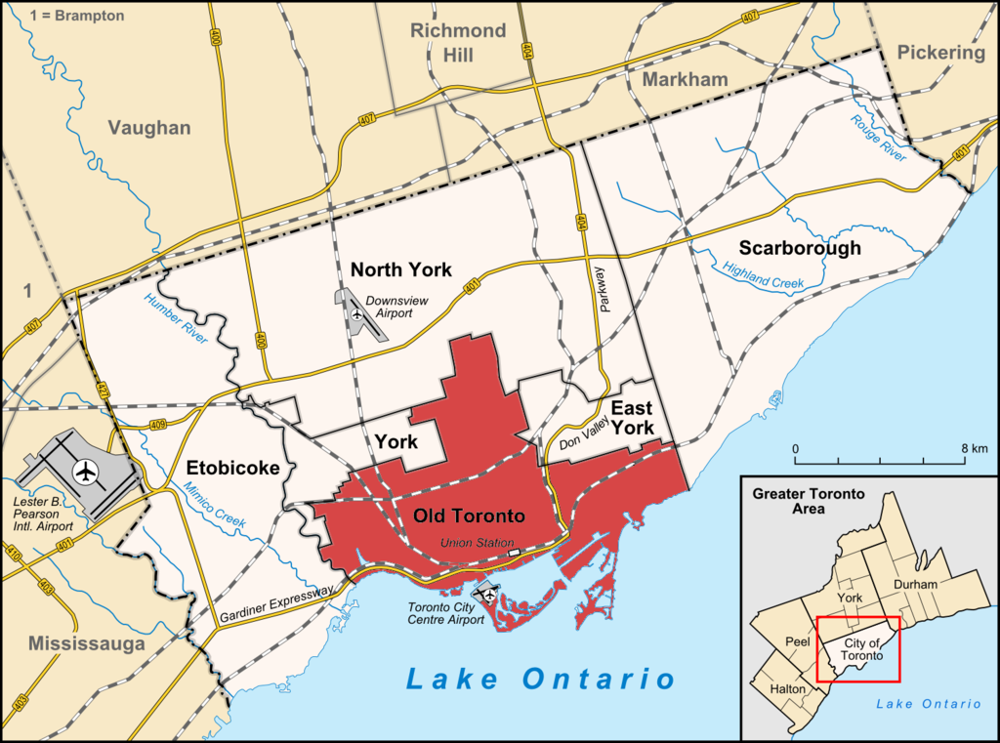
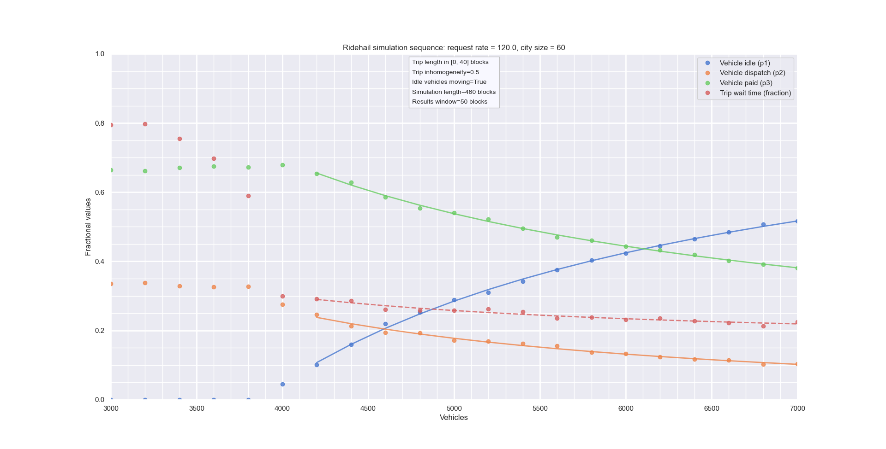
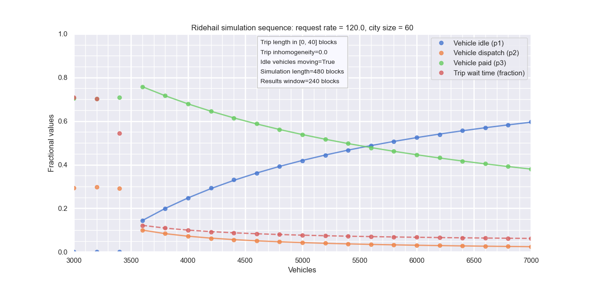
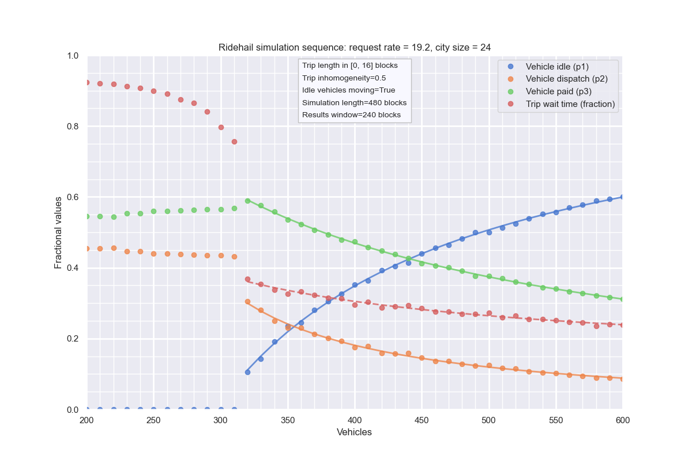
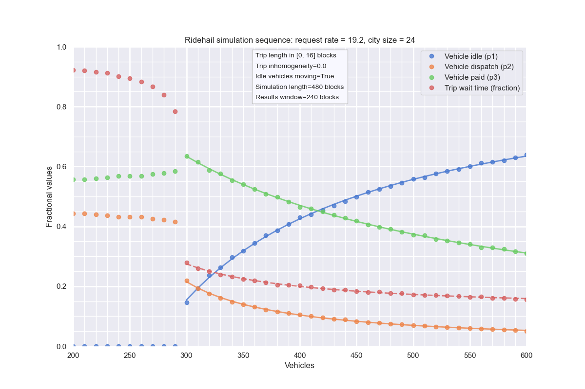
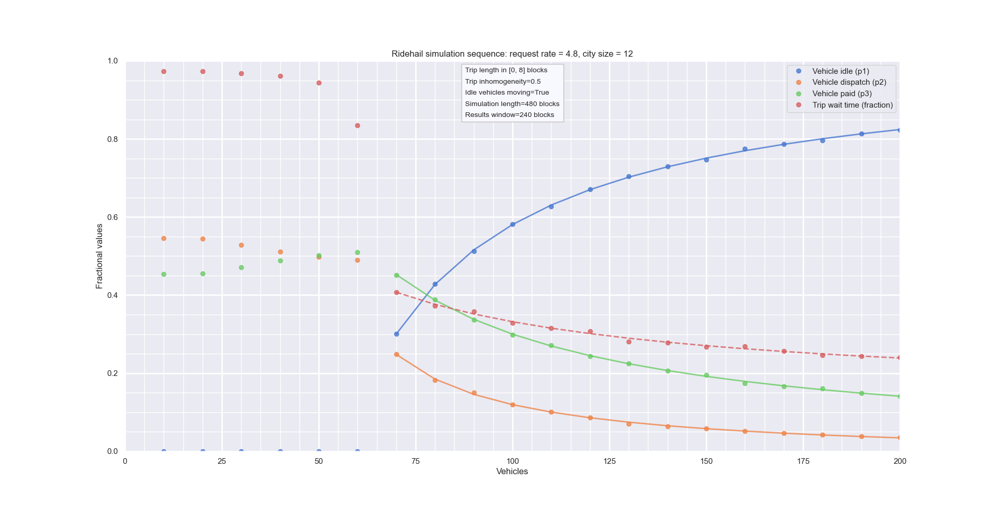
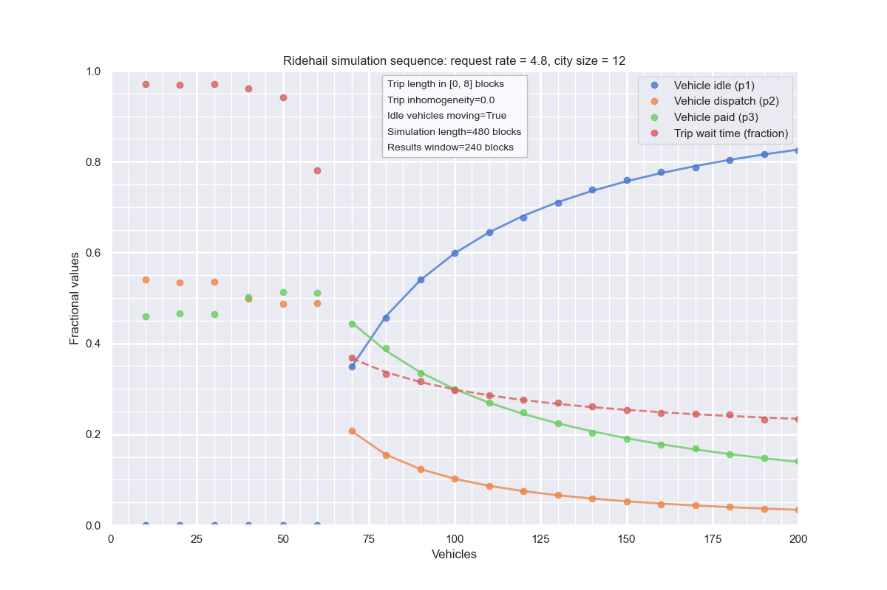

# Toronto

## Geography

The City of Toronto (also "Metro Toronto") is more than the "old city"
(following amalgamation) but less than "Greater Toronto" which includes
surrounding cities such as Mississauge and Brampton.

The City of Toronto includes (areas from Wikipedia):

- Old Toronto (97 km^2)
- East York (21.26 km^2)
- North York (177 km^2)
- Etobicoke York (124 km^2)
- Scarborough (188 km^2)
- York (24 km^2)

## Data

From [The Transportation Impacts of Vehicle-for-Hire in the City of
Toronto](https://wwiw.toronto.ca/wp-content/uploads/2019/0llj6/96c7-Report_v1.0_2019-06-21.pdf) (VFH1) and [The Transportation Impacts of Vehicle-for-Hire in the City of Toronto: October 2018 to July 2021](https://www.toronto.ca/wp-content/uploads/2021/11/98cd-VFHTransportationImpacts2021-11-23.pdf) (VFH2).

- "The average PTC in-vehicle time was 15 minutes" (VFH1 p 31)
- On Feb 6, 2020: average trip length = 8.13km, P1=40.5%, P2=11.2%,
  P3=48.3%. (VFH2 p25)
- March 2019: 176,000 daily trips (cf Chicago 300,000).
  - 150K trips / day => 7K/hr => 120 / minute
- The inner City (old city of Toronto, and East York) had 60% of trips.
- Average traffic speed in Toronto = 25 kph (in some 2014 study)
- The average wait time for completed trips in the City of Toronto has
  dropped from 4.2 minutes in September 2016 to 3.1 minutes in September
  (VFH1 p15)
- For trip distances, see VFH1 p 13. "almost 50% of trips being less than five
  kilometres and over 70% less than ten kilometers".
- Number of vehicles ~ 6000 (very rough) (VFH2 p25).
- 2018. Average wait times and others (eyeballed from chart on VFH2 p 16).
        Waiting at pick-up included in P2

  | Month    | Wait time | Daily vehicles (K) | trips/vehicle | P3  | P2  | P1  |
  | -------- | --------- | ------------------ | ------------- | --- | --- | --- |
  | Jan 2020 | 2.4 min   | 26                 | 6.7           | 47  | 10  | 42  |
  | Feb 2020 | 2.4 min   | 27                 | 6.8           | 48  | 11  | 41  |
  | Mar 2020 | 2.3 min   | 18                 | 6.1           | 45  | 45  | 10  |
  | Apr 2020 | 3.5 min   | 6.7                | 5.9           | 48  | 35  | 17  |
  | May 2020 | 4.2 min   | 7.5                | 6.7           | 55  | 20  | 25  |
  | Jun 2020 | 4.0 min   | 10                 | 6.6           | 54  | 19  | 28  |
  | Jul 2020 | 3.5 min   | 12                 | 6.9           | 55  | 18  | 27  |
  | Aug 2020 | 3.3 min   | 13                 | 6.9           | 56  | 17  | 28  |
  | Sep 2020 | 3.1 min   | 14                 | 6.3           | 52  | 15  | 33  |
  | Oct 2020 | 3.2 min   | 14                 | 5.5           | 47  | 13  | 41  |
  | Nov 2020 | 3.4 min   | 13                 | 5.5           | 47  | 13  | 40  |
  | Dec 2020 | 3.6 min   | 12.5               | 5.0           | 45  | 13  | 42  |
  | Jan 2021 | 3.4 min   | 12                 | 4.7           | 43  | 12  | 44  |
  | Feb 2021 | 3.6 min   | 12                 | 5.2           | 48  | 15  | 37  |
  | Mar 2021 | 3.5 min   | 13                 | 5.4           | 47  | 13  | 39  |
  | Apr 2021 | 3.5 min   | 12                 | 5.5           | 48  | 14  | 37  |
  | May 2021 | 4.0 min   | 11.5               | 6.0           | 53  | 16  | 31  |
  | Jun 2021 | 4.8 min   | 12                 | 6.7           | 51  | 30  | 19  |
  | Jul 2021 | 5.8 min   | 13                 | 6.3           | 60  | 20  | 20  |

## Simulations

See Notebook 2021-12-16.

Taking one block = 1 min ~ 0.5km:

{C = 60, <L> = 20, so L\_{max} = 40, A = 0.5 (60% of trips in 115 km^2 out of 630), R = 120 (requests per minute)}

From above: inhomogeneous city:

Same, but homogeneous:

### Scaling - 24 blocks

THESE ARE WRONG: I SHOULD NOT HAVE SCALED L

Inhomogeneous city:

Homogeneous city:

### Scaling - 12 blocks

Inhomogeneous city:

Homogeneous city:

